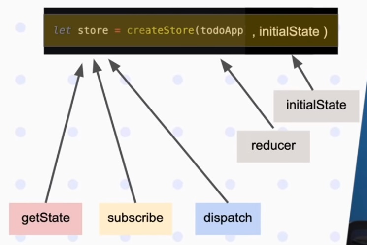

# JS - Redux

## Redux

Es una de las librerias más populares dentro del ecosistema de react y nos sirve para almacenar y modificar el estado global de nuestra aplicación.

Ahora intentaremos crear nuestro propio redux, pero para esto necesitamos entender algunas cosas.

### Así es como funciona redux

  

- Empezamos por el **store** donde estara nuestro estado inicial
- Luego tenemos el **state** de nuestra aplicación
- Nuestra **UI** puede cambiar el **state**
- Si el **state** cambia se llama a un **action** que define que es lo que queremos hacer
- La **action** ejecutara el **reducer** quien es el encargado de modificar el store con la lógica requerida

### APi de Redux

Nuestro objetivo es recrear redux y para eso tenemos que entender su API.

Primero tenemos nuestra store que va almacenar todo el estado de nuestra aplicación.

  

Esta Store es un objeto de donde vamos a recuperar diferentes funciones.

#### getState

Una función que no devolvera todo el estado de nuestra aplicación.

#### susbscribe

Una función a la cual le enviamos otra función que queremos que se ejecute cada vez que ocurre un cambio en le estado de nuestra app.

#### dispatch

Es la función con la cual invocamos cambios en nuestro estado, a la cual le vamos a enviar lo que en el ecosistema de redux llamamos actions.

  

Ahora la función **createStore**(la cual la obtenemos de la lib de redux) recibe dos parametros para que nos peuda devolver el estado con todo lo que mencionamos antes.

#### reducer

Es una función que se encarga de evaluar las actions

#### initialState

Para mockear como se deberia ver el estado de nuestra app, que es lo que se espera que nuestra app maneje.
